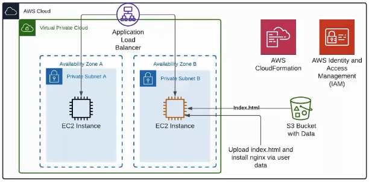

## Task description

### IaC template

#### Write AWS CloudFormation / Terraform template for this diagram



#### Additional

- Do the same in **Azure ARM** or **GCP Deploy Manager** and redraw the diagram
- Update **AWS** diagram, add missed instances
- Add **AWS EC2** **AutoRecovery** option
- Write the script-wrapper that have the ability to run different **Envs** with the different options

### Hints

- [https://docs.aws.amazon.com/AWSEC2/latest/UserGuide/ec2-instance-recover.html](https://docs.aws.amazon.com/AWSEC2/latest/UserGuide/ec2-instance-recover.html)
- [https://docs.aws.amazon.com/AWSCloudFormation/latest/UserGuide/Welcome.html](https://docs.aws.amazon.com/AWSCloudFormation/latest/UserGuide/Welcome.html)
- [https://docs.microsoft.com/en-us/azure/azure-resource-manager/templates/overview](https://docs.microsoft.com/en-us/azure/azure-resource-manager/templates/overview)
- [https://cloud.google.com/deployment-manager/docs](https://cloud.google.com/deployment-manager/docs)
- [https://en.wikipedia.org/wiki/Infrastructure_as_code](https://en.wikipedia.org/wiki/Infrastructure_as_code)
- [https://www.terraform.io/docs/providers/index.html](https://www.terraform.io/docs/providers/index.html)
- [https://www.terraform.io/docs/index.html](https://www.terraform.io/docs/index.html)
- [https://registry.terraform.io/browse/providers](https://registry.terraform.io/browse/providers)

### Prerequisites

To follow this task you will need:

- The [Terraform CLI](https://www.terraform.io/downloads.html) installed.
- The [AWS CLI](https://docs.aws.amazon.com/cli/latest/userguide/install-cliv2.html) installed.
- [An AWS account](https://aws.amazon.com/free/).
- Your AWS credentials. You can [create a new Access Key on this page](https://console.aws.amazon.com/iam/home?#/security_credentials).

Configure the AWS CLI and Terraform from your terminal.

```
aws configure
terraform init
```

You can format and validate the configuration files by using these commands:

```
terraform fmt
terraform validate
```

<details>
    <summary>Terraform plan</summary>
    ```
    terraform plan
    ```
    ```
    tls_private_key.main: Refreshing state... [id=7e61767cca90d3c6b623fb28b3ffdea605887f7b]
    local_file.ec2_private_key: Refreshing state... [id=ebd8f10825bc396947ba20af161a5daa062aeeb2]
    aws_key_pair.main: Refreshing state... [id=main]
    module.vpc.aws_vpc.this[0]: Refreshing state... [id=vpc-09bec9e44c7b99be9]
    aws_s3_bucket.task6_http: Refreshing state... [id=task6-http]
    aws_iam_role.ec2_role: Refreshing state... [id=ec2_role]
    aws_iam_role_policy.ec2_policy: Refreshing state... [id=ec2_role:ec2_policy]
    aws_iam_instance_profile.ec2_profile: Refreshing state... [id=ec2_profile]
    aws_lb_target_group.alb_tg: Refreshing state... [id=arn:aws:elasticloadbalancing:us-west-1:398332759214:targetgroup/my-target-group/9e5c939358faeefb]
    aws_security_group.alb_sg: Refreshing state... [id=sg-0b2246979a4c34ec0]
    module.vpc.aws_internet_gateway.this[0]: Refreshing state... [id=igw-09c5768196ae1f342]
    module.vpc.aws_subnet.public[1]: Refreshing state... [id=subnet-01aea12b4e7d29f59]
    module.vpc.aws_subnet.public[0]: Refreshing state... [id=subnet-0fec902cb9a5ac24d]
    module.vpc.aws_route_table.public[0]: Refreshing state... [id=rtb-050205836987ec3cb]
    module.vpc.aws_route_table_association.public[1]: Refreshing state... [id=rtbassoc-0bf382e46a38bf003]
    module.vpc.aws_route_table_association.public[0]: Refreshing state... [id=rtbassoc-034edcac68f2173d7]
    module.vpc.aws_route.public_internet_gateway[0]: Refreshing state... [id=r-rtb-050205836987ec3cb1080289494]
    aws_lb.alb: Refreshing state... [id=arn:aws:elasticloadbalancing:us-west-1:398332759214:loadbalancer/app/my-alb/42f389f0ae52f278]
    aws_lb_listener.alb_listener: Refreshing state... [id=arn:aws:elasticloadbalancing:us-west-1:398332759214:listener/app/my-alb/42f389f0ae52f278/d9c9300cb8a697b4]
    aws_s3_bucket_object.file_upload: Refreshing state... [id=index.html]
    aws_instance.compute_nodes[0]: Refreshing state... [id=i-070c5701f20a9f2bf]
    aws_instance.compute_nodes[1]: Refreshing state... [id=i-0468099a6c1d58e9b]
    aws_lb_target_group_attachment.target_registration[1]: Refreshing state... [id=arn:aws:elasticloadbalancing:us-west-1:398332759214:targetgroup/my-target-group/9e5c939358faeefb-20210705160850113100000001]
    aws_lb_target_group_attachment.target_registration[0]: Refreshing state... [id=arn:aws:elasticloadbalancing:us-west-1:398332759214:targetgroup/my-target-group/9e5c939358faeefb-20210705160850200800000002]

    Note: Objects have changed outside of Terraform

    Terraform detected the following changes made outside of Terraform since the last "terraform apply":

    # aws_instance.compute_nodes[0] has been changed
    ~ resource "aws_instance" "compute_nodes" {
            id                                   = "i-070c5701f20a9f2bf"
        ~ security_groups                      = [
            - "sg-0b2246979a4c34ec0",
            ]
            tags                                 = {
                "Name" = "my-compute-node-0"
            }
            # (29 unchanged attributes hidden)


            # (5 unchanged blocks hidden)
        }
    # aws_instance.compute_nodes[1] has been changed
    ~ resource "aws_instance" "compute_nodes" {
            id                                   = "i-0468099a6c1d58e9b"
        ~ security_groups                      = [
            - "sg-0b2246979a4c34ec0",
            ]
            tags                                 = {
                "Name" = "my-compute-node-1"
            }
            # (29 unchanged attributes hidden)


            # (5 unchanged blocks hidden)
        }
    # local_file.ec2_private_key has been deleted
    - resource "local_file" "ec2_private_key" {
        - content              = (sensitive) -> null
        - directory_permission = "0777" -> null
        - file_permission      = "0777" -> null
        - filename             = "./ec2_private_key.pem" -> null
        - id                   = "ebd8f10825bc396947ba20af161a5daa062aeeb2" -> null
        }

    Unless you have made equivalent changes to your configuration, or ignored the relevant attributes using ignore_changes, the following plan may include actions to undo or respond to these changes.

    ─────────────────────────────────────────────────────────────────────────────────────────────────────────────────────────────────────────────────────────────────────────────────────────────────────────────────────────────────────────────────────────────────────────────────────────────────────────────────────────

    Terraform used the selected providers to generate the following execution plan. Resource actions are indicated with the following symbols:
    + create
    ~ update in-place
    -/+ destroy and then create replacement

    Terraform will perform the following actions:

    # aws_instance.compute_nodes[0] must be replaced
    -/+ resource "aws_instance" "compute_nodes" {
        ~ ami                                  = "ami-02f24ad9a1d24a799" -> "ami-0ed05376b59b90e46" # forces replacement
        ~ arn                                  = "arn:aws:ec2:us-west-1:398332759214:instance/i-070c5701f20a9f2bf" -> (known after apply)
        ~ associate_public_ip_address          = true -> (known after apply)
        ~ availability_zone                    = "us-west-1b" -> (known after apply)
        ~ cpu_core_count                       = 1 -> (known after apply)
        ~ cpu_threads_per_core                 = 1 -> (known after apply)
        - disable_api_termination              = false -> null
        - ebs_optimized                        = false -> null
        - hibernation                          = false -> null
        + host_id                              = (known after apply)
        ~ id                                   = "i-070c5701f20a9f2bf" -> (known after apply)
        ~ instance_initiated_shutdown_behavior = "stop" -> (known after apply)
        ~ instance_state                       = "running" -> (known after apply)
        ~ ipv6_address_count                   = 0 -> (known after apply)
        ~ ipv6_addresses                       = [] -> (known after apply)
        - monitoring                           = false -> null
        + outpost_arn                          = (known after apply)
        + password_data                        = (known after apply)
        + placement_group                      = (known after apply)
        ~ primary_network_interface_id         = "eni-0e3472fad3a13bb05" -> (known after apply)
        ~ private_dns                          = "ip-10-0-101-245.us-west-1.compute.internal" -> (known after apply)
        ~ private_ip                           = "10.0.101.245" -> (known after apply)
        + public_dns                           = (known after apply)
        ~ public_ip                            = "54.241.137.137" -> (known after apply)
        ~ secondary_private_ips                = [] -> (known after apply)
        ~ security_groups                      = [ # forces replacement
            + "sg-0b2246979a4c34ec0",
            ]
            tags                                 = {
                "Name" = "my-compute-node-0"
            }
        ~ tenancy                              = "default" -> (known after apply)
        ~ user_data                            = "f211d78eb140c49ba7b42cd4ad3474db26cb7426" -> "c0b5ab9681e8c37c26ebdf4d3e065a82860b7f64" # forces replacement
        ~ vpc_security_group_ids               = [
            - "sg-0b2246979a4c34ec0",
            ] -> (known after apply)
            # (7 unchanged attributes hidden)

        ~ capacity_reservation_specification {
            ~ capacity_reservation_preference = "open" -> (known after apply)

            + capacity_reservation_target {
                + capacity_reservation_id = (known after apply)
                }
            }

        - credit_specification {
            - cpu_credits = "standard" -> null
            }

        + ebs_block_device {
            + delete_on_termination = (known after apply)
            + device_name           = (known after apply)
            + encrypted             = (known after apply)
            + iops                  = (known after apply)
            + kms_key_id            = (known after apply)
            + snapshot_id           = (known after apply)
            + tags                  = (known after apply)
            + throughput            = (known after apply)
            + volume_id             = (known after apply)
            + volume_size           = (known after apply)
            + volume_type           = (known after apply)
            }

        ~ enclave_options {
            ~ enabled = false -> (known after apply)
            }

        + ephemeral_block_device {
            + device_name  = (known after apply)
            + no_device    = (known after apply)
            + virtual_name = (known after apply)
            }

        ~ metadata_options {
            ~ http_endpoint               = "enabled" -> (known after apply)
            ~ http_put_response_hop_limit = 1 -> (known after apply)
            ~ http_tokens                 = "optional" -> (known after apply)
            }

        + network_interface {
            + delete_on_termination = (known after apply)
            + device_index          = (known after apply)
            + network_interface_id  = (known after apply)
            }

        ~ root_block_device {
            ~ delete_on_termination = true -> (known after apply)
            ~ device_name           = "/dev/xvda" -> (known after apply)
            ~ encrypted             = false -> (known after apply)
            ~ iops                  = 100 -> (known after apply)
            + kms_key_id            = (known after apply)
            ~ tags                  = {} -> (known after apply)
            ~ throughput            = 0 -> (known after apply)
            ~ volume_id             = "vol-0c97f1ab2deccdae0" -> (known after apply)
            ~ volume_size           = 8 -> (known after apply)
            ~ volume_type           = "gp2" -> (known after apply)
            }
        }

    # aws_instance.compute_nodes[1] must be replaced
    -/+ resource "aws_instance" "compute_nodes" {
        ~ ami                                  = "ami-02f24ad9a1d24a799" -> "ami-0ed05376b59b90e46" # forces replacement
        ~ arn                                  = "arn:aws:ec2:us-west-1:398332759214:instance/i-0468099a6c1d58e9b" -> (known after apply)
        ~ associate_public_ip_address          = true -> (known after apply)
        ~ availability_zone                    = "us-west-1c" -> (known after apply)
        ~ cpu_core_count                       = 1 -> (known after apply)
        ~ cpu_threads_per_core                 = 1 -> (known after apply)
        - disable_api_termination              = false -> null
        - ebs_optimized                        = false -> null
        - hibernation                          = false -> null
        + host_id                              = (known after apply)
        ~ id                                   = "i-0468099a6c1d58e9b" -> (known after apply)
        ~ instance_initiated_shutdown_behavior = "stop" -> (known after apply)
        ~ instance_state                       = "running" -> (known after apply)
        ~ ipv6_address_count                   = 0 -> (known after apply)
        ~ ipv6_addresses                       = [] -> (known after apply)
        - monitoring                           = false -> null
        + outpost_arn                          = (known after apply)
        + password_data                        = (known after apply)
        + placement_group                      = (known after apply)
        ~ primary_network_interface_id         = "eni-099d5c2dee722c040" -> (known after apply)
        ~ private_dns                          = "ip-10-0-102-127.us-west-1.compute.internal" -> (known after apply)
        ~ private_ip                           = "10.0.102.127" -> (known after apply)
        + public_dns                           = (known after apply)
        ~ public_ip                            = "54.215.205.68" -> (known after apply)
        ~ secondary_private_ips                = [] -> (known after apply)
        ~ security_groups                      = [ # forces replacement
            + "sg-0b2246979a4c34ec0",
            ]
            tags                                 = {
                "Name" = "my-compute-node-1"
            }
        ~ tenancy                              = "default" -> (known after apply)
        ~ user_data                            = "f211d78eb140c49ba7b42cd4ad3474db26cb7426" -> "c0b5ab9681e8c37c26ebdf4d3e065a82860b7f64" # forces replacement
        ~ vpc_security_group_ids               = [
            - "sg-0b2246979a4c34ec0",
            ] -> (known after apply)
            # (7 unchanged attributes hidden)

        ~ capacity_reservation_specification {
            ~ capacity_reservation_preference = "open" -> (known after apply)

            + capacity_reservation_target {
                + capacity_reservation_id = (known after apply)
                }
            }

        - credit_specification {
            - cpu_credits = "standard" -> null
            }

        + ebs_block_device {
            + delete_on_termination = (known after apply)
            + device_name           = (known after apply)
            + encrypted             = (known after apply)
            + iops                  = (known after apply)
            + kms_key_id            = (known after apply)
            + snapshot_id           = (known after apply)
            + tags                  = (known after apply)
            + throughput            = (known after apply)
            + volume_id             = (known after apply)
            + volume_size           = (known after apply)
            + volume_type           = (known after apply)
            }

        ~ enclave_options {
            ~ enabled = false -> (known after apply)
            }

        + ephemeral_block_device {
            + device_name  = (known after apply)
            + no_device    = (known after apply)
            + virtual_name = (known after apply)
            }

        ~ metadata_options {
            ~ http_endpoint               = "enabled" -> (known after apply)
            ~ http_put_response_hop_limit = 1 -> (known after apply)
            ~ http_tokens                 = "optional" -> (known after apply)
            }

        + network_interface {
            + delete_on_termination = (known after apply)
            + device_index          = (known after apply)
            + network_interface_id  = (known after apply)
            }

        ~ root_block_device {
            ~ delete_on_termination = true -> (known after apply)
            ~ device_name           = "/dev/xvda" -> (known after apply)
            ~ encrypted             = false -> (known after apply)
            ~ iops                  = 100 -> (known after apply)
            + kms_key_id            = (known after apply)
            ~ tags                  = {} -> (known after apply)
            ~ throughput            = 0 -> (known after apply)
            ~ volume_id             = "vol-01459f2a9841f1866" -> (known after apply)
            ~ volume_size           = 8 -> (known after apply)
            ~ volume_type           = "gp2" -> (known after apply)
            }
        }

    # aws_lb_target_group_attachment.target_registration[0] must be replaced
    -/+ resource "aws_lb_target_group_attachment" "target_registration" {
        ~ id               = "arn:aws:elasticloadbalancing:us-west-1:398332759214:targetgroup/my-target-group/9e5c939358faeefb-20210705160850200800000002" -> (known after apply)
        ~ target_id        = "i-070c5701f20a9f2bf" -> (known after apply) # forces replacement
            # (2 unchanged attributes hidden)
        }

    # aws_lb_target_group_attachment.target_registration[1] must be replaced
    -/+ resource "aws_lb_target_group_attachment" "target_registration" {
        ~ id               = "arn:aws:elasticloadbalancing:us-west-1:398332759214:targetgroup/my-target-group/9e5c939358faeefb-20210705160850113100000001" -> (known after apply)
        ~ target_id        = "i-0468099a6c1d58e9b" -> (known after apply) # forces replacement
            # (2 unchanged attributes hidden)
        }

    # aws_s3_bucket_object.file_upload will be updated in-place
    ~ resource "aws_s3_bucket_object" "file_upload" {
        ~ etag               = "870c2d9c40fa2581b74d99f7103e427f" -> "e72b88c45ce2815a5bd2f84fb84fc526"
            id                 = "index.html"
            tags               = {}
        + version_id         = (known after apply)
            # (10 unchanged attributes hidden)
        }

    # local_file.ec2_private_key will be created
    + resource "local_file" "ec2_private_key" {
        + content              = (sensitive)
        + directory_permission = "0777"
        + file_permission      = "0777"
        + filename             = "./ec2_private_key.pem"
        + id                   = (known after apply)
        }

    ```

</details>
